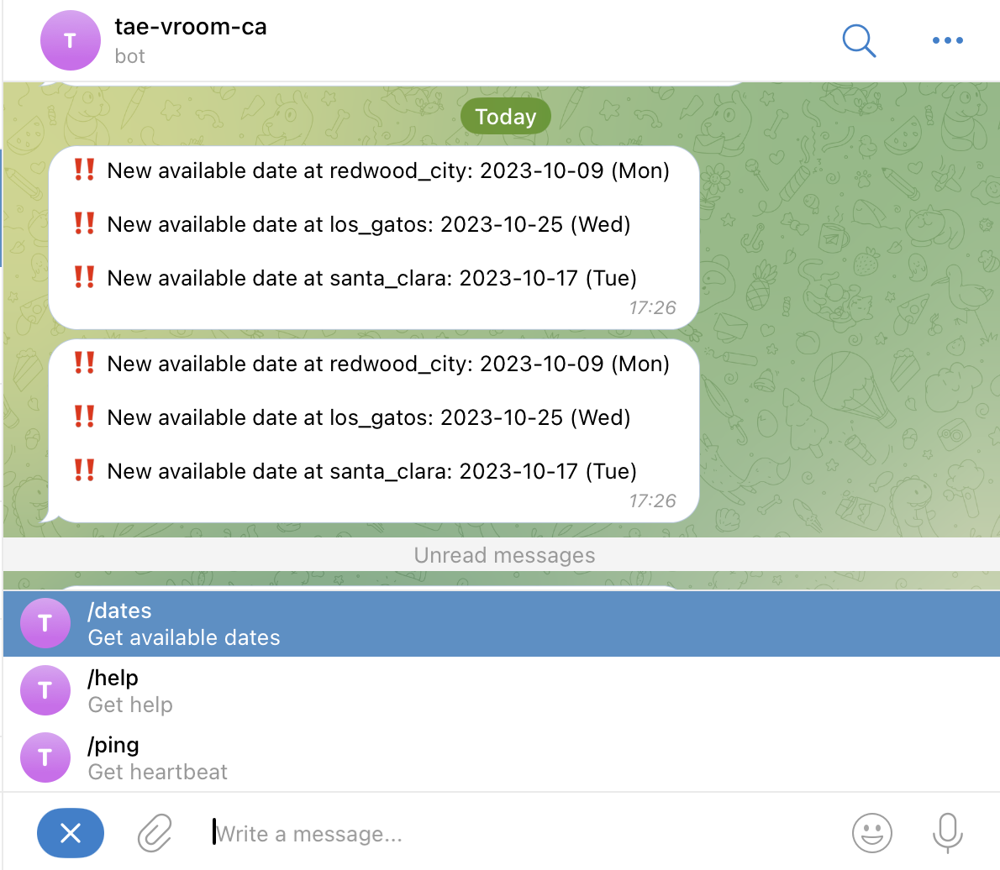

# California DMV Appointment Availability Tracker
## Introduction
I needed to find an appointment at the DMV for my behind-the-wheel test, but the available dates were months away (as of August 2023). To catch any canceled appointments, I wrote a script that periodically checks for available slots and sends me a notification via Telegram if one opens up. I was able to find an appointment within a day of running the script.

## Screenshot

## Usage
1. Fill in the configuration constants in `bot.py`
2. Install the required packages with `pip install -r requirements.txt`
3. Run the script using `python bot.py`

## Notes
- This script will NOT create appointments for you. It will only notify you if there is an available appointment. You will have to book the appointment yourself.
- Choose a reasonable lookup interval to avoid overwhelming the API endpoint.
- There were some ghost appointments that were not actually available when I tried to book them.
- Currently, the script includes branch codes for several SF Bay Area DMVs. To add a different branch, you will need to extract the branch code by inspecting the network traffic the DMV website generates when searching for appointments.
- This script was written in just a few hours, so it is not very robust or sophisticated, but it got the job done. It may break if the DMV endpoint changes.

## Disclaimer
This script is for educational purposes only (again, it will NOT create an appointment for you). I am not responsible for any misuse of this script. Please use it responsibly.

## License
GPLv3